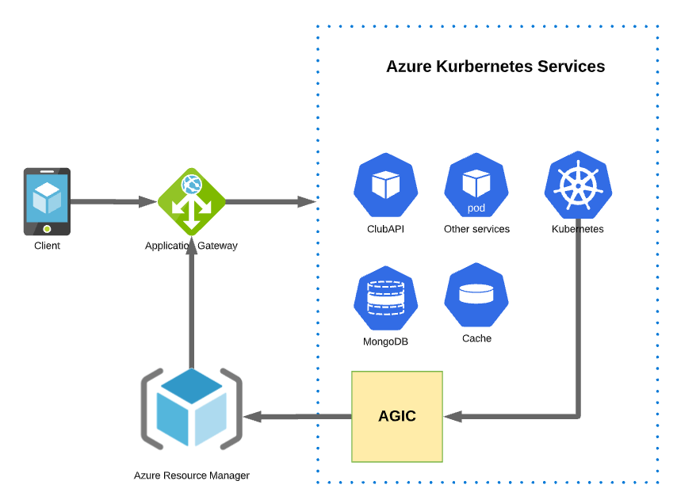

# ClubAPI

## Requirement
Serving around 500K daily active users, these microservices are expected to be:
- Cloud-ready
- Fault-tolerant
- Resilient to cyber attacks
- Highly concurrent
- Have low latency
- Have high throughput
- Have good maintainability
- Have good observability

## Designer


## Components
- AGIC helps eliminate the need to have another load balancer/public IP in front of the AKS cluster and avoids multiple hops in your datapath before requests reach the AKS cluster.
- Application Gateway in addition to AGIC is used helps protect your AKS cluster by providing TLS policy and Web Application Firewall (WAF) functionality. Thay also support load balancing. [Click here to see how to deploy AGIC with AG](https://docs.microsoft.com/en-us/azure/application-gateway/ingress-controller-overview)
- Azure Kubernetes Service is used to host microservices and mongo database. It's a container orchestration allow highly concurrent, good maintainability, good obervability and Fault-tolerant
- MongoDB is a NoSQL database which is deployed to Kubernetes. It allow the clubAPI can read and manipulate data with low latency and high throughput. 
## API
Clubs will expose three REST endpoints

### POST api/clubs
This endpoint allows players to create a club.
#### Request model:
```
Content-Type: application/json
Accept: application/json
Player-ID: 123
{
    "name": "My Awesome Club"
}
```
#### Response model:
```
201 Created
Content-Type: application/json
Location: /api/clubs/5e324948-6a88-40e6-8b09-578d061de816
{
    "id": "5e324948-6a88-40e6-8b09-578d061de816",
    "members": [123]
}
```
The only constraint is the name of a club must be unique across the entire club database. If a club
with the same name already exists, then the API should return HTTP 409.
### GET api/clubs/{clubId}

#### Request:
```
Accept: application/json
Club-ID: "5e324948-6a88-40e6-8b09-578d061de816"
```

#### Response:
```
200 OK
Content-Type: application/json
{
    "id": "5e324948-6a88-40e6-8b09-578d061de816",
    "members": [123,12,789]
}
```
return HTTP 404 when the club with the given club ID is not found

### POST api/clubs/{clubId}/members
This endpoint should idempotently add a member (playerId specified in the request body) into
the club (clubId specified in the URL)

#### Request
```
Accept: application/json
Content-Type: application/json
Player-ID: 123
{
    "playerId": 234
}
```
#### Response
```
204 No Content
Content-Type: application/json
```
## Author
**Hong Pham (Gary)**

- [Profile](https://github.com/hongph85 "Hong Pham")
- [Email](mailto:hongph85@gmail.com?subject=Hi "Hi!")
- [Linkedin](https://www.linkedin.com/in/hongph85 "Linkedin")

## 🤝 Support

Contributions, issues, and feature requests are welcome!

Give a ⭐️ if you like this project!
